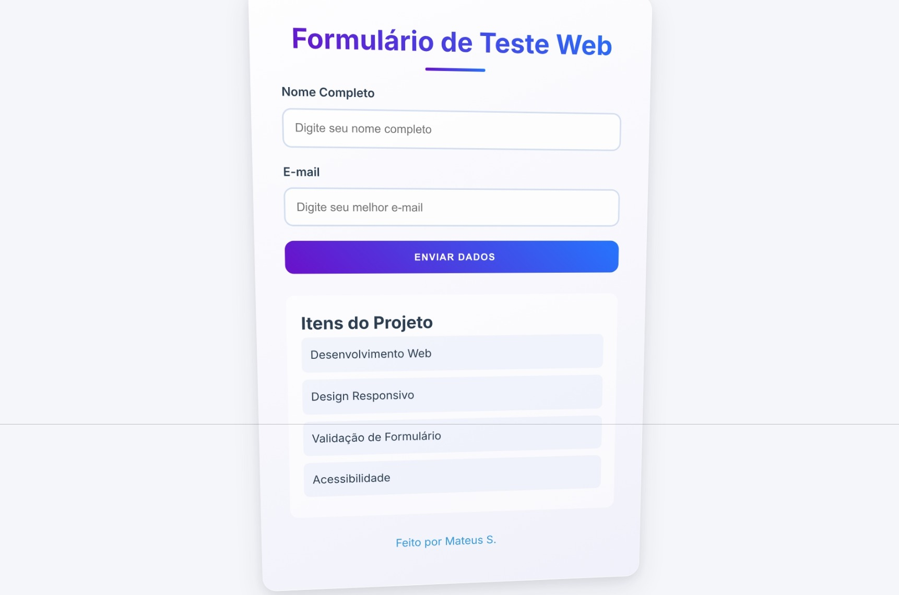
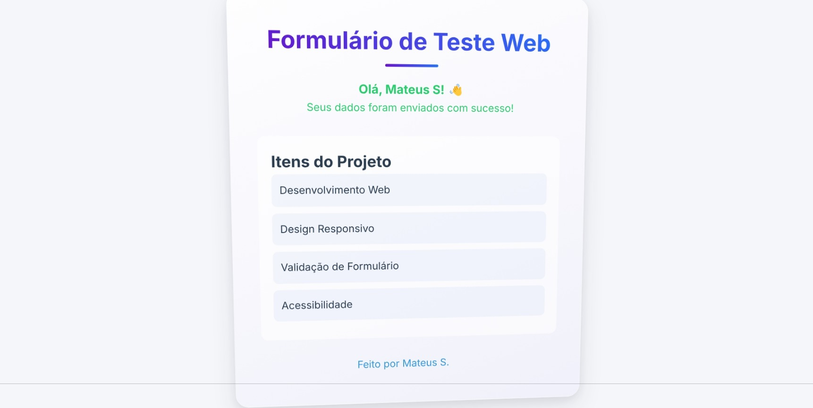

# Formulário Web para Testes

   > DESCRICAO DO PROJETO
   ----------------------
   Projeto de formulario web que demonstra tecnicas modernas de 
   desenvolvimento frontend, com validacao avancada, design responsivo 
   e testes abrangentes de qualidade.

   ## Imagens

*Captura de tela 1*

*Captura de tela 2*

   > TECNOLOGIAS UTILIZADAS
   ------------------------
   * HTML5           * CSS3 (Avancado)
   * JavaScript      * Design Responsivo
   * Validacao       * Acessibilidade Web

   > RECURSOS PRINCIPAIS
   ---------------------
   * Validacao em tempo real
   * Tratamento dinamico de erros
   * Design responsivo e adaptativo
   * Interface de usuario acessivel
   * Padroes modernos de interacao
   * Compatibilidade entre navegadores

   > AMBIENTE DE DESENVOLVIMENTO
   -----------------------------
   * Versao recomendada do Node.js: 14.x+
   * Extensoes recomendadas do VS Code:
     - Live Server
     - ESLint
     - Prettier

   > METRICAS DE DESEMPENHO
   -----------------------
   * Pontuacao Lighthouse: 90-100
   * Responsividade Mobile: Verificado
   * Acessibilidade: Verificado
   * Boas Praticas: Verificado

   > DIRETRIZES DE CONTRIBUICAO
   ---------------------------
   1. Fazer fork do repositorio
   2. Criar branch de funcionalidade
   3. Commitar alteracoes
   4. Enviar para branch
   5. Abrir pull request

## Créditos

Desenvolvido por Mateus S.  
GitHub: [Matz-Turing](https://github.com/Matz-Turing)
